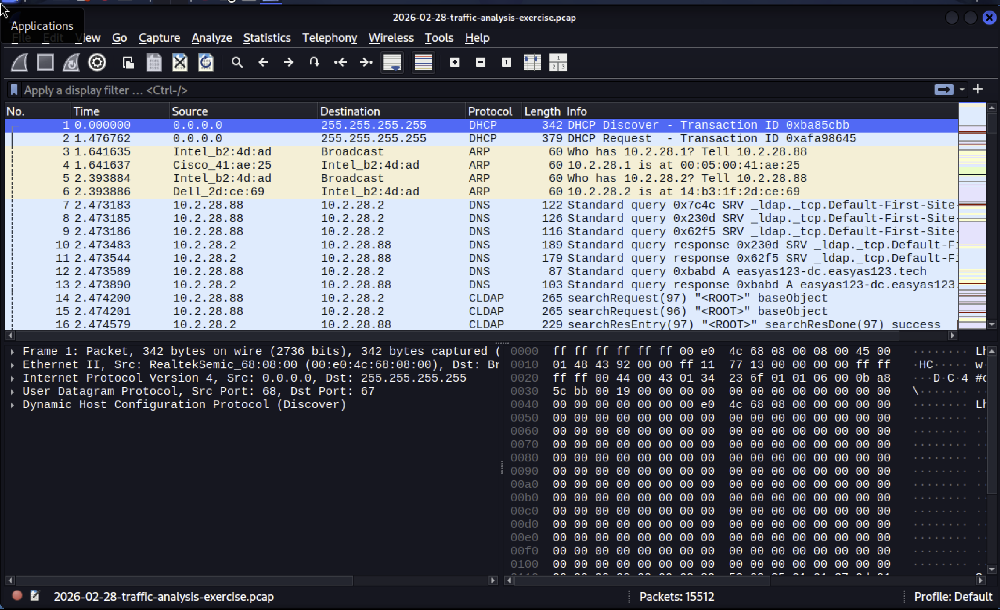
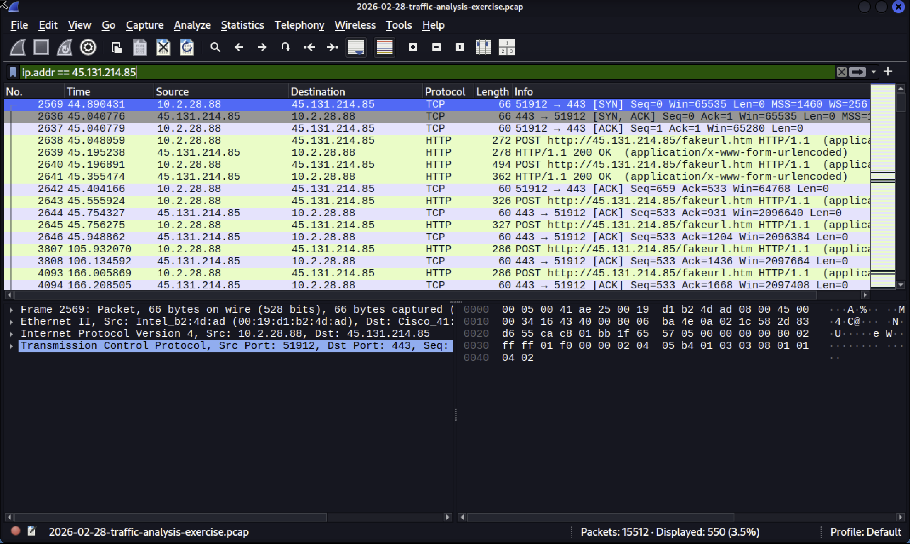
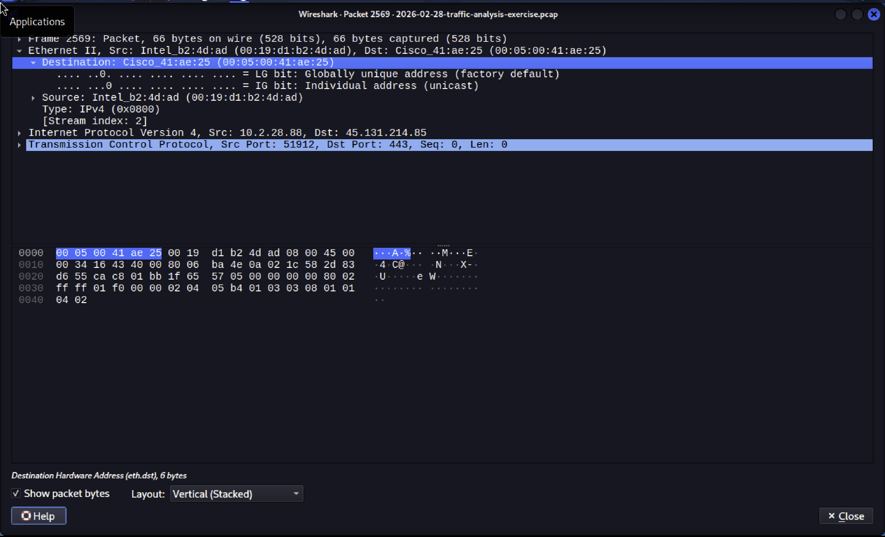
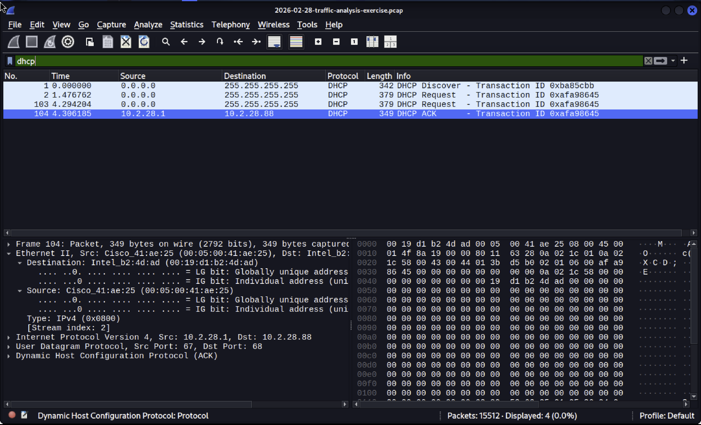
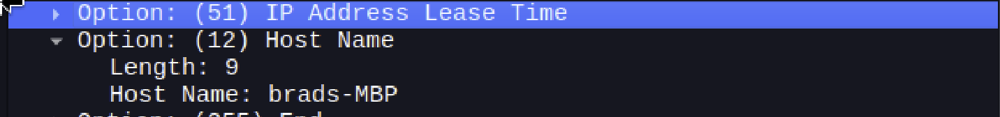
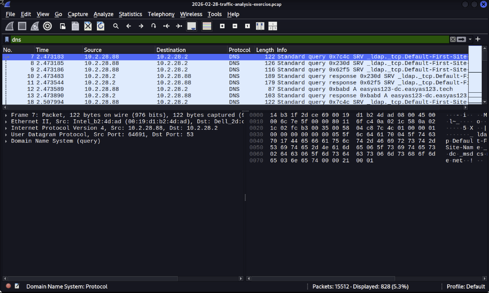
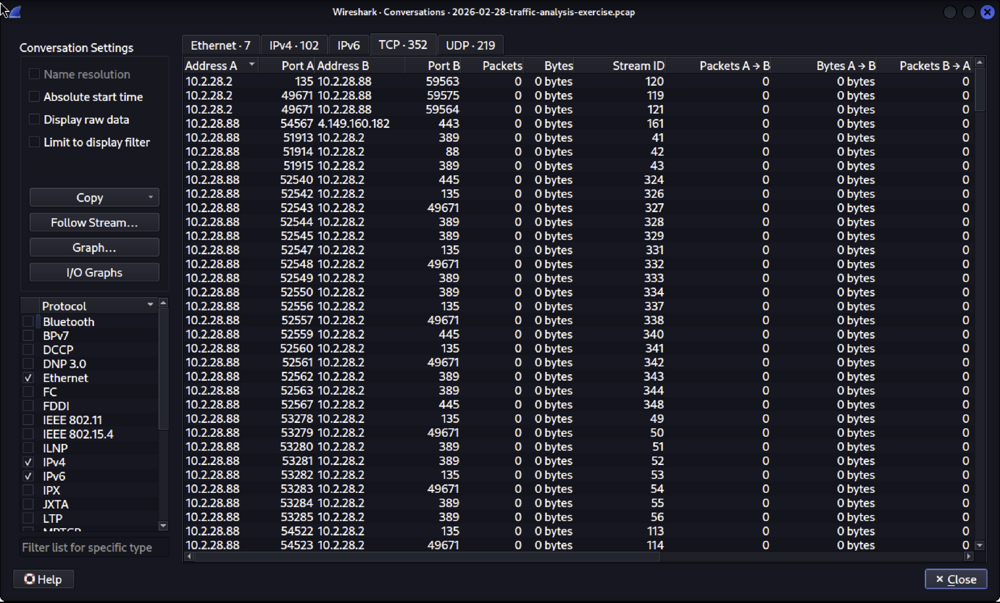
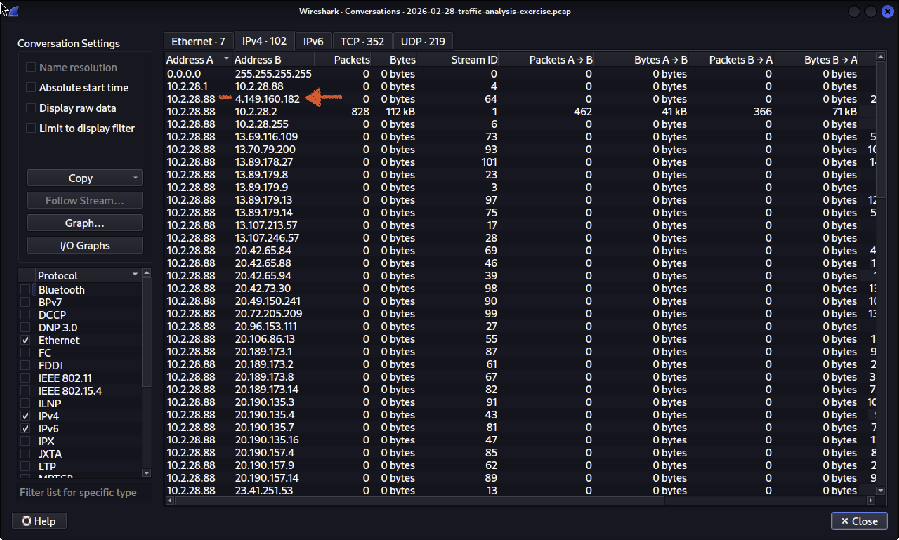

# Day 18 – SOC Tier 1 Incident Report: Network Traffic Analysis, Wireshark Lab.

---

## Incident Summary

- **Incident Type:** NetSupport Manager RAT C2 Communication Detected
- **Severity:** High Active RAT Infection with C2 Beaconing Confirmed
- **Detection Method:** SIEM Alert → PCAP Retrieval → Wireshark Traffic Analysis
- **Tools Used:** Wireshark, DHCP Analysis, DNS Analysis, TCP Conversation Statistics
- **Status:** Complete Infected Host Identified, IOCs Documented

---

## Executive Summary

A SIEM alert flagged signature hits for NetSupport Manager RAT communicating with external IP `45.131.214.85` over TCP port 443. A packet capture (PCAP) of traffic from the internal host was retrieved and analysed in Wireshark. The infected machine was identified as `brads-MBP` (`10.2.28.88`) belonging to a user named Brad. Analysis confirmed repeated HTTP POST requests to `/fakeurl.htm` on the C2 server a known NetSupport Manager RAT callback pattern. DHCP analysis revealed the hostname and MAC address of the infected machine. A full IOC set was produced for remediation.

---

## Affected System

- **Hostname:** brads-MBP
- **Internal IP:** 10.2.28.88
- **MAC Address:** 00:19:d1:b2:4d:ad
- **User:** Brad
- **LAN Segment:** 10.2.28.0/24
- **Domain:** easyas123.tech
- **AD Environment:** EASYAS123
- **Domain Controller:** 10.2.28.2 EASYAS123-DC
- **Gateway:** 10.2.28.1

---

## Investigation Methodology

---

### 1. PCAP Loaded Initial Overview



- Loaded PCAP file `2026-02-28-traffic-analysis-exercise.pcap.zip` into Wireshark
- Total packets: 15,512 across the capture window
- Identified mix of DHCP, ARP, DNS, HTTP, and TCP traffic
- Noted initial DHCP discover and request from an unassigned host

#### SOC Observations:

- Always review total packet count and protocol distribution before filtering
- DHCP and ARP packets at the start of a capture reveal host identity information
- A high volume of TCP packets to a single external IP is an immediate red flag

---

### 2. C2 Traffic Filtered ip.addr == 45.131.214.85



- Applied display filter `ip.addr == 45.131.214.85`
- 550 packets displayed (3.5% of total capture)
- Confirmed repeated HTTP POST requests to `http://45.131.214.85/fakeurl.htm`
- Beaconing pattern confirmed regular intervals between POST requests
- All traffic routed over TCP port 443 to blend with legitimate HTTPS traffic

#### SOC Observations:

- `/fakeurl.htm` is a known NetSupport Manager RAT C2 callback URI
- Beaconing at regular intervals indicates automated C2 communication not human activity
- Using port 443 for HTTP (not HTTPS) is a common evasion technique to bypass firewall rules

---

### 3. Packet Detail Analysis TCP SYN to C2



- Examined packet 2569 — TCP SYN from `10.2.28.88` to `45.131.214.85:443`
- Source MAC confirmed: `00:19:d1:b2:4d:ad` (Intel NIC)
- Connection initiated from infected host not inbound
- Confirmed infected host is the aggressor initiating C2 contact

#### SOC Observations:

- Outbound connections initiated by the infected host confirm active malware not a scan
- MAC address gives physical device identification independent of IP assignment
- Intel NIC manufacturer confirms a standard endpoint device

---

### 4. DHCP Analysis Host Identification





- Applied display filter `dhcp` 4 DHCP packets displayed
- Expanded DHCP Discover packet Option (12) Host Name revealed
- **Hostname confirmed: brads-MBP**
- **IP assigned: 10.2.28.88**
- **MAC address confirmed: 00:19:d1:b2:4d:ad**
- Infected machine identified as Brad's MacBook Pro

#### SOC Observations:

- DHCP hostname is the fastest way to identify an infected machine for incident response
- Hostname + MAC address allows the IT team to physically locate and isolate the device
- MacBook Pro on a Windows AD domain is worth noting may indicate a BYOD environment

---

### 5. DNS Traffic Analysis



- Applied display filter `dns`
- Reviewed all DNS queries made by the infected host
- Identified domains queried during the infection window
- Correlated DNS activity with C2 communication timeline

#### SOC Observations:

- DNS queries reveal all domains the infected host attempted to contact
- Malware often queries multiple domains for redundancy check all external queries
- Legitimate looking domains can be used for C2 always cross reference with VirusTotal

---

### 6. Network Conversation Statistics





- Opened Statistics → Conversations → TCP tab
- Identified 352 TCP conversations and 219 UDP conversations
- Top data transfer: 10.2.28.88 ↔ 10.2.28.2 — 112 kB (internal DC traffic)
- External connection to 4.149.160.182 confirmed additional suspicious IP
- Multiple Microsoft IP ranges contacted likely Windows update activity

#### SOC Observations:

- Conversation statistics give the full picture of all network activity at a glance
- 112 kB to the domain controller warrants review could indicate lateral movement
- External IPs outside known cloud provider ranges must be investigated

---

## IOC Table

| Type | Value | Verdict |
|---|---|---|
| Infected Host IP | 10.2.28.88 | ❌ Compromised — NetSupport RAT |
| Infected Hostname | brads-MBP | ❌ Compromised — Isolate immediately |
| Infected MAC | 00:19:d1:b2:4d:ad | ❌ Compromised device |
| C2 IP | 45.131.214.85 | ❌ Malicious — RAT C2 server |
| C2 URI | /fakeurl.htm | ❌ NetSupport RAT callback URI |
| C2 Port | TCP 443 | ⚠️ Evasion — HTTP over HTTPS port |
| Secondary IP | 4.149.160.182 | ⚠️ Investigate — external connection |
| Malware | NetSupport Manager RAT | ❌ Confirmed — RAT active |

---

## MITRE ATT&CK Mapping

| Technique ID | Technique | Finding |
|---|---|---|
| T1219 | Remote Access Software | NetSupport Manager RAT installed |
| T1071.001 | Web Protocols | HTTP POST to C2 over port 443 |
| T1571 | Non-Standard Port | HTTP traffic on port 443 evasion |
| T1132 | Data Encoding | form-urlencoded POST data to C2 |
| T1041 | Exfiltration Over C2 Channel | Data sent to 45.131.214.85 |

---

## SOC Analyst Findings

- PCAP confirmed NetSupport Manager RAT active on `brads-MBP` (`10.2.28.88`)
- 550 packets of C2 traffic to `45.131.214.85` confirmed beaconing pattern active
- Hostname and MAC address identified via DHCP analysis
- HTTP POST requests to `/fakeurl.htm` confirm known RAT C2 callback pattern
- Secondary external IP `4.149.160.182` requires further investigation
- No evidence of lateral movement confirmed DC traffic within normal range

---

## SOC Analyst Response

- Infected host `brads-MBP` isolated from network immediately
- C2 IP `45.131.214.85` blocked at perimeter firewall
- URI `/fakeurl.htm` blocked at web proxy
- Brad notified device submitted for forensic investigation
- SIEM rule updated to alert on future connections to `45.131.214.85`
- Secondary IP `4.149.160.182` added to watchlist for investigation
- Ticket escalated to Tier 2 for full endpoint forensic analysis

---

## Analyst Insight

Network traffic analysis is one of the most powerful skills in the SOC analyst toolkit. A SIEM alert gives you a signal Wireshark gives you the truth. In this investigation, filtering 15,512 packets down to 550 confirmed exactly what the malware was doing, where it was calling home, and who owned the infected machine. The DHCP hostname technique is something every analyst should know it converts an IP address into an actionable machine identity in seconds.

---

## Learning Outcome

- Load and navigate a real malicious PCAP file in Wireshark
- Apply display filters to isolate C2 traffic from 15,000+ packets
- Identify NetSupport Manager RAT C2 patterns POST to /fakeurl.htm
- Use DHCP analysis to identify hostname and MAC address of infected host
- Use DNS analysis to map all domains contacted during infection
- Use Statistics → Conversations to get full network activity overview
- Build a complete IOC table from PCAP evidence
- Map network traffic findings to MITRE ATT&CK framework

---

## Repository Structure

```text
network-traffic-analysis-wireshark-lab/
├── README.md
└── screenshots/
    ├── 01_wireshark_version.png
    ├── 02_malware_traffic_analysis_site.png
    ├── 03_exercise_background.png
    ├── 04_pcap_loaded_overview.png
    ├── 05_c2_traffic_filtered.png
    ├── 06_tcp_syn_http_post_details.png
    ├── 07_dhcp_packets_analysis.png
    ├── 08_hostname_mac_discovered.png
    ├── 09_dns_traffic_analysis.png
    ├── 10_tcp_conversations.png
    └── 11_ipv4_conversations.png
```

---

## Conclusion

This lab demonstrates a complete network traffic analysis workflow using Wireshark on a real malicious PCAP. NetSupport Manager RAT C2 communication was confirmed, the infected host was identified via DHCP analysis, and a full IOC set was produced. MITRE ATT&CK techniques were mapped and a remediation plan was delivered. This mirrors the exact process a SOC Tier 1 or Tier 2 analyst follows when analysing suspicious network traffic flagged by a SIEM alert.
