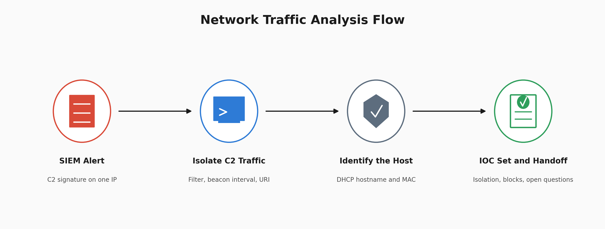
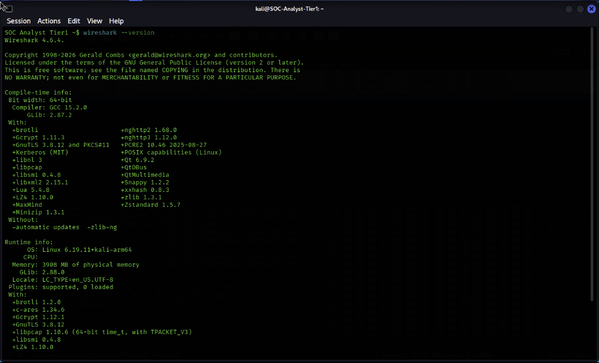

# Network Traffic Analysis, NetSupport RAT C2

A SIEM alert identified suspicious communication with a known NetSupport Manager RAT destination. Wireshark was then used to investigate the traffic, identify the affected host, and build an evidence based IOC set for response.



## At a Glance

| Field | Detail |
| --- | --- |
| Alert Type | RAT command and control activity |
| Severity | High |
| Malware | NetSupport Manager RAT |
| Affected Host | brads-MBP, 10.2.28.88, 00:19:d1:b2:4d:ad |
| C2 Server | 45.131.214.85 |
| C2 Activity | Repeated HTTP POST requests to /fakeurl.htm over TCP 443 |
| Capture Size | 15,512 packets |
| Filtered C2 Traffic | 550 packets, 3.5 percent of capture |
| Outcome | Host attributed through DHCP evidence, C2 activity investigated, IOC set produced |

## What Happened

A SIEM signature identified NetSupport Manager RAT traffic involving `45.131.214.85` over TCP 443.

The associated PCAP was opened in Wireshark to investigate the activity beyond the original network indicator.

The alert provided the suspicious destination.

The packet capture provided additional context, including the internal source IP, connection direction, repeated HTTP POST activity, hostname, MAC address, and other network conversations involving the affected host.

Scope stated plainly: this is a published training capture from a malware traffic analysis exercise, not an incident on a network I defend.

The investigation demonstrates the analytical workflow used to move from an alert indicator toward endpoint identification and network scoping.

## Environment



Wireshark `4.6.4` was verified before the capture was analysed.

Checking the tool version establishes the environment used for the investigation and helps make the analysis reproducible.

## PCAP Overview


The capture contained:

```text
15,512 packets
```

Visible traffic included DHCP, ARP, DNS, HTTP, TCP, and other network activity.

The initial packets included DHCP activity from a host that had not yet received its address.

Rather than immediately filtering for the alert indicator, the capture was first reviewed at a high level to understand the traffic environment.

That initial review later became useful because DHCP provided evidence that could be used to identify the affected endpoint.

## C2 Traffic Isolated


The original SIEM indicator was used as the first investigation pivot:

```text
ip.addr == 45.131.214.85
```

The filter returned:

```text
550 packets
3.5 percent of the capture
```

The traffic showed repeated HTTP POST requests involving:

```text
45.131.214.85
/fakeurl.htm
TCP 443
```

The repeated POST activity at regular intervals is consistent with automated beaconing.

Timing regularity alone does not prove malicious activity because legitimate software can also communicate periodically.

In this investigation, the timing pattern is interpreted together with the original NetSupport Manager RAT signature context, destination IP, repeated outbound communication, and HTTP request pattern.

The `/fakeurl.htm` requests provide additional network evidence consistent with the NetSupport Manager RAT activity identified by the exercise.

### Protocol Versus Port

Another important observation was the use of plain HTTP over TCP port 443.

Port 443 is normally associated with HTTPS, but a port number does not determine the application protocol actually being used.

The packet evidence showed HTTP communication using a port normally associated with encrypted HTTPS traffic.

That protocol and port mismatch is more useful analytically than simply observing traffic to port 443.

## Connection Direction


Packet `2569` shows the initial TCP SYN:

```text
Source IP: 10.2.28.88
Destination IP: 45.131.214.85
Source Port: 51912
Destination Port: 443
Source MAC: 00:19:d1:b2:4d:ad
```

The SYN establishes that `10.2.28.88` initiated this connection to the external destination.

Connection direction does not independently prove compromise.

Its value comes from correlation.

The exercise began with a NetSupport Manager RAT signature involving the destination. The PCAP then showed repeated outbound HTTP communication from the internal host to that same destination.

Together, those observations strengthen the assessment that the suspicious communication originated from the internal endpoint rather than representing unsolicited inbound probing.

## Host Identification via DHCP


The DHCP traffic was isolated with:

```text
dhcp
```

Four DHCP packets were visible.

The DHCP evidence correlated the internal address with additional endpoint information.


DHCP Option 12 identified:

```text
Hostname: brads-MBP
IP address: 10.2.28.88
MAC address: 00:19:d1:b2:4d:ad
```

This turns the original IP based alert into stronger endpoint attribution.

`10.2.28.88` is a dynamically assigned network address.

During this capture, DHCP correlates that address with the hostname `brads-MBP` and MAC address `00:19:d1:b2:4d:ad`.

Those identifiers provide the response team with more useful endpoint context than the leased IP address alone.

The hostname itself is not used to infer the operating system or physical hardware of the endpoint.

## DNS Analysis


DNS traffic can provide additional infrastructure pivots during a network investigation.

The filter used was:

```text
dns
```

Queries involving the affected host can be reviewed against the suspicious activity timeline to identify domains that may deserve additional investigation.

A DNS request by itself does not establish that a domain is malicious or related to the RAT.

Any unfamiliar domains would need additional correlation before being classified as associated infrastructure.

This prevents normal host activity from being automatically attributed to malware simply because it appears in the same capture.

## Conversation Statistics


Wireshark conversation statistics were reviewed to understand what else `10.2.28.88` communicated with during the capture.

The capture contained:

```text
352 TCP conversations
219 UDP conversations
```

One visible internal conversation involved:

```text
10.2.28.88 → 10.2.28.2
112 kB
```

The exercise environment identifies `10.2.28.2` as the domain controller.

The traffic volume alone does not establish whether this communication was malicious or benign.

Protocol level analysis would be required before classifying the activity as normal authentication, policy traffic, lateral movement, or another behaviour.

The conversation view also exposed another external destination:

```text
4.149.160.182
```

That connection was not explained by the original alert and remains an investigation question.

This is important because filtering only on the known C2 indicator can confirm the activity already described by the alert while hiding other potentially relevant communication.

The conversation view provides a broader scope of the endpoint's network activity.

## IOC and Investigation Table

| Type | Value | Assessment |
| --- | --- | --- |
| Affected host IP | 10.2.28.88 | Source of investigated C2 communication |
| Hostname | brads-MBP | Correlated through DHCP |
| MAC address | 00:19:d1:b2:4d:ad | Correlated with affected host during capture |
| C2 IP | 45.131.214.85 | NetSupport Manager RAT destination identified by exercise |
| C2 URI | /fakeurl.htm | Observed in repeated HTTP POST requests |
| C2 port | TCP 443 | HTTP observed over port normally associated with HTTPS |
| Unexplained IP | 4.149.160.182 | Requires additional investigation |
| Malware context | NetSupport Manager RAT | Provided by original SIEM signature and supported by investigated network activity |

## MITRE ATT&CK Mapping

The mappings below are limited to behaviour supported by the exercise context and packet evidence.

| Tactic | Technique | ID | Evidence |
| --- | --- | --- | --- |
| Command and Control | Remote Access Tools | T1219 | NetSupport Manager RAT activity identified by the exercise SIEM context and investigated in the PCAP |
| Command and Control | Application Layer Protocol: Web Protocols | T1071.001 | Repeated HTTP POST communication with the C2 destination |
| Command and Control | Non Standard Port | T1571 | Plain HTTP communication observed over TCP 443 |

### Mappings Removed During Review

Two mappings from an earlier version were removed because the packet evidence did not support them strongly enough.

**T1132, Data Encoding**

The POST body was described as form URL encoded.

Form encoding is a standard HTTP submission format and does not by itself demonstrate deliberate C2 data encoding or obfuscation.

The mapping was therefore removed.

**T1041, Exfiltration Over C2 Channel**

The capture demonstrates outbound C2 communication.

It does not establish that stolen information was transmitted through that channel.

Beaconing and exfiltration are different claims.

Without evidence showing actual data exfiltration, T1041 would assign an outcome that the capture does not demonstrate.

## Analyst Conclusion

The investigation identified repeated outbound communication from `10.2.28.88` to `45.131.214.85`, the NetSupport Manager RAT destination provided by the exercise's SIEM context.

The C2 filter returned `550` packets, representing `3.5 percent` of the capture.

Repeated HTTP POST requests to `/fakeurl.htm` were observed over TCP 443.

The timing pattern was consistent with automated beaconing and was assessed together with the SIEM signature context and other packet evidence rather than treated as standalone proof.

TCP connection analysis showed that `10.2.28.88` initiated communication with the external destination.

DHCP evidence correlated `10.2.28.88` with:

```text
Hostname: brads-MBP
MAC address: 00:19:d1:b2:4d:ad
```

This provided stronger endpoint attribution for response and handoff.

Communication with the domain controller at `10.2.28.2` was observed but not classified as malicious or benign based on volume alone.

The external destination `4.149.160.182` remains unexplained and should be investigated further.

The PCAP supports the assessment of active NetSupport Manager RAT C2 communication involving the identified host.

It does not establish how the RAT arrived on the endpoint, what endpoint processes were responsible, or whether data was exfiltrated.

## Recommended Response

Isolate the affected endpoint using the available host identifiers and verify the device through endpoint management or asset inventory before taking action.

Block or monitor communication with:

```text
45.131.214.85
```

Review proxy and network controls for requests involving:

```text
/fakeurl.htm
```

Create detection logic for the known C2 indicator while also considering behavioural detection for unexpected plain HTTP communication over TCP 443.

Submit the endpoint for forensic investigation.

The PCAP establishes suspicious network communication but does not identify the initial infection vector or responsible endpoint process.

Investigate:

```text
4.149.160.182
```

before closing the network investigation.

Review the `10.2.28.88` to `10.2.28.2` conversation at the protocol level before assigning a benign or malicious verdict.

Escalate the case with the identified host information, network indicators, packet evidence, and unresolved questions clearly documented.

## What This Lab Demonstrates

* Starting with a SIEM network indicator and validating the activity in packet data.
* Reducing a 15,512 packet capture to the traffic relevant to the original alert.
* Recognising repeated communication patterns consistent with automated beaconing.
* Distinguishing the observed application protocol from the destination port.
* Using TCP SYN direction to establish which endpoint initiated a connection.
* Correlating an IP address with hostname and MAC information through DHCP.
* Using conversation statistics to expand investigation scope beyond the original indicator.
* Preserving an unexplained external connection as an open investigation question.
* Separating C2 communication from unsupported claims of data exfiltration.
* Removing ATT&CK mappings when the packet evidence does not demonstrate the technique.

## Lessons Learned

The biggest lesson from this investigation was that one packet feature should not carry the entire verdict.

Regular timing can support a beaconing assessment, but legitimate software can also communicate periodically.

An outbound SYN establishes connection direction, but outbound communication alone does not prove malware.

A suspicious URI can strengthen malware attribution, but it should be interpreted alongside the original detection context and surrounding traffic.

The strongest conclusion comes from correlation.

In this investigation, the SIEM signature, known destination, repeated HTTP POST activity, connection direction, and DHCP host attribution build a much stronger evidence chain together than any one of those observations could provide independently.

The ATT&CK review reinforced the same lesson.

Form URL encoding does not automatically demonstrate Data Encoding.

C2 beaconing does not automatically demonstrate exfiltration.

A malware family may be capable of many behaviours, but the investigation should document what the evidence demonstrates rather than every capability associated with that malware.

## What I Would Improve

I would follow several TCP streams containing the POST requests and compare their body content.

That would help determine whether the requests are simple check ins or whether additional information is being exchanged through the channel.

I would investigate `4.149.160.182` before final handoff rather than leaving the destination unresolved.

I would also perform deeper protocol analysis of the communication between `10.2.28.88` and the domain controller at `10.2.28.2` before classifying that activity.

Finally, I would correlate the PCAP findings with endpoint telemetry if it were available.

Process creation, network connection telemetry, persistence evidence, and file information could connect the network activity to the process responsible for generating it and help determine how the RAT became active on the endpoint.

## Investigation Flow

```text
SIEM Alert
    ↓
C2 Indicator Identified
    ↓
PCAP Loaded in Wireshark
    ↓
C2 Traffic Isolated
    ↓
Connection Direction Established
    ↓
Host Correlated Through DHCP
    ↓
Additional Conversations Reviewed
    ↓
IOC Set and Open Questions Documented
    ↓
Response and Tier 2 Handoff
```

## Repository Structure

```text
.
└── screenshots/
    ├── 00_architecture.png
    ├── 01_wireshark_version.png
    ├── 04_pcap_loaded_overview.png
    ├── 05_c2_traffic_filtered.png
    ├── 06_tcp_syn_http_post_details.png
    ├── 07_dhcp_packets_analysis.png
    ├── 08_hostname_mac_discovered.png
    ├── 09_dns_traffic_analysis.png
    ├── 10_tcp_conversations.png
    └── 11_ipv4_conversations.png
```

The screenshot numbering reflects the evidence retained in the final repository.

---

## Author

William Gokah

SOC Analyst Portfolio

[](https://linkedin.com/in/WilliamInCyber) [](https://x.com/WilliamInCyber)
